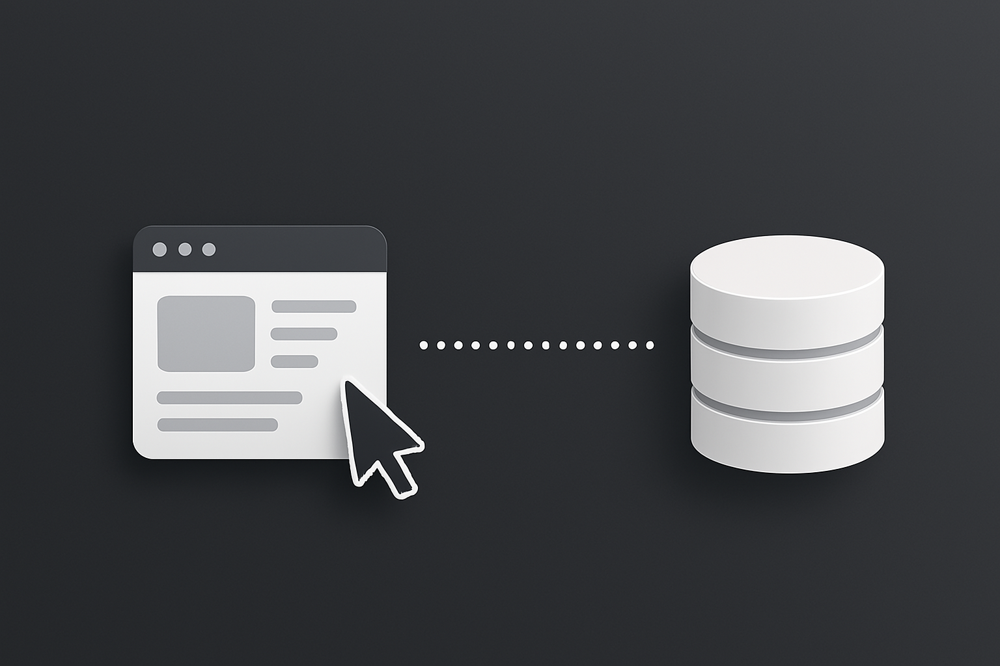

# 📊 WebScraping for Market Research: Notebooks on Mercado Livre  
### 🔎 ETL Pipeline with Web Scraping, SQLite, Pandas and Streamlit  
**Prototype developed based on the course "[Jornada de Dados - Pipeline ETL Python](https://suajornadadedados.com.br/)"**


---

## 📌 About the Project

This project implements a complete data pipeline focused on **web scraping of notebook listings on Mercado Livre**, data transformation and cleaning with **Pandas**, local storage using **SQLite**, and an interactive dashboard with **Streamlit**. It simulates a real-world market research scenario to support business decision-making.

The application allows you to explore:
- The most popular notebook brands.
- Average prices per brand.
- Customer satisfaction based on user reviews.
- Key market metrics (KPIs).

---



---

## ⚙️ Technologies Used

| Tool         | Description |
|--------------|-------------|
| **Scrapy**   | Automated web data extraction. |
| **Pandas**   | Data cleaning, transformation, and analysis. |
| **SQLite**   | Lightweight relational database for local storage. |
| **Streamlit**| Interactive web interface for data visualization. |
| **Python**   | Primary programming language (Python 3.8+ recommended). |

---

## 🧠 Key Concepts Covered

- Building **Spiders** with pagination support.
- Using **CSS selectors** to extract structured data.
- Data transformation with Pandas (cleaning, type conversion, filtering).
- Integration with SQLite using `sqlite3`.
- Dashboard creation and **KPI visualizations with Streamlit**.
- Full implementation of an **ETL pipeline**.

---

## 🗂️ Project Structure

```
ETL/
│
├── data/                      # Data folder
│   ├── data.jsonl             # Raw data collected
│   └── mercadolivre.db        # Cleaned data stored in SQLite
├── docs/
│   ├── tutorial_etl           # ETL Tutorial pt-BR
│   ├── tutorial_etl_en        # ETL Tutorial 
├── src/                       
│   ├── dashboard/
│   │   └── app.py             # Aplicação interativa Streamlit
│   ├── extraction             
│   │   └──scrapy.cfg
│   │   └── coleta.py
│   │       └── spiders
│   │           └── notebook.py # Spider para coletar dados de notebooks
│   ├── transformLoad
│   │   └── main.py            # Spider to scrape notebook data
├── README.md
└── requirements.txt           # Project dependencies

```
---

## 🚀 How to Run the Project

### 1. Clone the repository

```bash
git clone https://github.com/yourusername/mercado-livre-notebooks.git
cd mercado-livre-notebooks
```

### 2. Create and activate a virtual environment (recommended)

```bash
python -m venv venv
# Windows
venv\Scripts\activate
# macOS/Linux
source venv/bin/activate
```

### 3. Install dependencies

```bash
pip install -r requirements.txt
```

### 4. Run the Scrapy spider

```bash
scrapy crawl notebook -o data/data.jsonl
```

### 5. Process and load data into the database

```bash
python main.py
```

### 6. Launch the Streamlit dashboard

```bash
streamlit run app.py
```

---

## 📈 Application Features

- **Main KPIs**: total notebooks, unique brands, average price.
- **Top Brands**: bar chart of most frequent notebook brands.
- **Average Price by Brand**: price analysis per brand.
- **Average Satisfaction**: user rating comparison by brand.

---

## 🧪 Sample Data Collected

| brand   | name                          | seller     | new_money | reviews_rating_number |
|---------|-------------------------------|------------|-----------|------------------------|
| Lenovo  | Notebook Lenovo IdeaPad 3     | TecHouse   | 2599.90   | 4.7                    |
| Dell    | Inspiron 15                   | DELL_BR    | 3499.00   | 4.5                    |
| Acer    | Acer Aspire 5                 | AcerStore  | 2899.00   | 4.6                    |
| Samsung | Galaxy Book3                  | SamsungBR  | 3199.00   | 4.8                    |
| Asus    | Vivobook 15                   | FastStore  | 2799.00   | 4.4                    |

## 📅 Data Collection Date

The data was automatically collected from the Mercado Livre website on **April 10th, 2025** using a Scrapy spider.

---

## 🧑‍🎓 Target Audience

This project was designed for:
- Students of **Data Science** and **Data Engineering**.
- **Business Intelligence** professionals.
- Small and medium businesses interested in market research.
- People learning **Python for Data Analysis**.

---

## 💼 Commercial Applications

This solution can be applied by:
- **E-commerce retailers** to monitor competitors.
- **Marketing departments** to refine pricing strategies.
- **BI and analytics consultants** delivering data-driven insights.
- **Market research companies** needing real-world data.

---

## 🧾 License

This project is licensed under the **MIT License**.  
You are free to use, copy, modify, merge, publish, distribute, sublicense, and/or sell copies of the Software.

For more details, please refer to the [LICENSE](./LICENSE) file.

---
