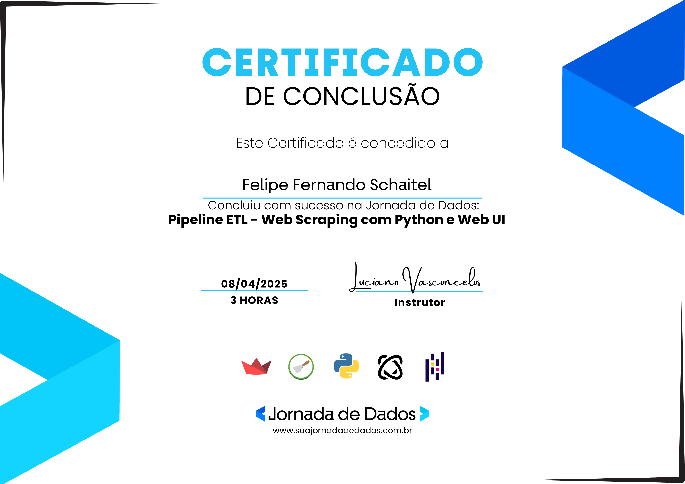

# 📊 WebScraping para Pesquisa de Mercado: Notebooks no Mercado Livre  
### 🔎 Pipeline ETL com Web Scraping, SQLite, Pandas e Streamlit  
**Protótipo desenvolvido na formação "[Jornada de Dados - Pipeline ETL Python](https://suajornadadedados.com.br/)"**


---

## 📌 Sobre o Projeto

Este projeto implementa um pipeline completo de dados com foco em **web scraping de notebooks no Mercado Livre**, transformação e tratamento com **Pandas**, armazenamento com **SQLite** e visualização interativa com **Streamlit**. Ele simula um ambiente real de análise de mercado para apoiar decisões estratégicas de negócio.

A aplicação permite explorar:
- As marcas mais populares de notebooks.
- A média de preços por marca.
- Indicadores de satisfação com base em avaliações.
- Métricas essenciais de mercado (KPIs).

---

## ⚙️ Tecnologias Utilizadas

| Ferramenta     | Descrição |
|----------------|-----------|
| **Scrapy**     | Coleta de dados web de forma automatizada. |
| **Pandas**     | Transformação, limpeza e análise dos dados. |
| **SQLite**     | Banco de dados local para persistência. |
| **Streamlit**  | Interface web interativa e intuitiva. |
| **Python**     | Linguagem principal do projeto (versão 3.8+ recomendada). |

---

## 🧠 Conceitos Trabalhados

- Criação de **Spiders** com navegação por páginas.
- Uso de **seletores CSS** para extrair informações estruturadas.
- Transformações com Pandas (limpeza, conversão de tipos, filtros).
- Integração com banco de dados relacional via `sqlite3`.
- Criação de visualizações e **KPIs interativos com Streamlit**.
- Prática completa de um **pipeline ETL**.

---

## 🗂️ Estrutura do Projeto

```
ETL/
│
├── data/                      # Armazenamento local de dados
│   ├── data.jsonl             # Dados brutos coletados
│   └── mercadolivre.db        # Banco de dados SQLite com dados limpos
├── docs/
│   ├── tutorial_etl           # Tutorial de ETL
│   ├── tutorial_etl_en        # Tutorial de ETL em Inglês
├── src/                       # Projeto
│   ├── dashboard/
│   │   └── app.py             # Aplicação interativa Streamlit
│   ├── extraction             
│   │   └──scrapy.cfg
│   │   └── coleta.py
│   │       └── spiders
│   │           └── notebook.py # Spider para coletar dados de notebooks
│   ├── transformLoad
│   │   └── main.py            # Script de transformação dos dados
├── README.md
└── requirements.txt           # Dependências do projeto

```

---

## 🚀 Como Executar o Projeto

### 1. Clone o repositório

```bash
git clone https://github.com/seuusuario/mercado-livre-notebooks.git
cd mercado-livre-notebooks
```

### 2. Crie e ative o ambiente virtual (opcional, mas recomendado)

```bash
python -m venv venv
# Windows
venv\Scripts\activate
# Linux/macOS
source venv/bin/activate
```

### 3. Instale as dependências

```bash
pip install -r requirements.txt
```

### 4. Execute o spider do Scrapy

```bash
scrapy crawl notebook -o data/data.jsonl
```

### 5. Execute o script de transformação e carga no banco

```bash
python main.py
```

### 6. Inicie a aplicação Streamlit

```bash
streamlit run app.py
```

---

## 📈 Funcionalidades da Aplicação

- **KPIs principais**: total de notebooks, número de marcas únicas, preço médio.
- **Marcas mais frequentes**: gráfico de barras com contagem por marca.
- **Preço médio por marca**: análise comparativa de valores.
- **Satisfação média**: média das avaliações dos usuários por marca.

---

## 🧪 Exemplo de Dados Coletados

| brand   | name                          | seller     | new_money | reviews_rating_number |
|---------|-------------------------------|------------|-----------|------------------------|
| Lenovo  | Notebook Lenovo IdeaPad 3     | TecHouse   | 2599.90   | 4.7                    |
| Dell    | Inspiron 15                   | DELL_BR    | 3499.00   | 4.5                    |
| Acer    | Acer Aspire 5                 | AcerStore  | 2899.00   | 4.6                    |
| Samsung | Galaxy Book3                  | SamsungBR  | 3199.00   | 4.8                    |
| Asus    | Vivobook 15                   | FastStore  | 2799.00   | 4.4                    |

## 📅 Data da Coleta

Os dados foram coletados automaticamente do site Mercado Livre no dia **10 de abril de 2025** utilizando o spider Scrapy.

---

## 📊 Indicadores-Chave de Desempenho (KPIs)

Neste projeto, os **KPIs (Key Performance Indicators)** são utilizados para fornecer uma visão geral objetiva e rápida sobre o comportamento do mercado de notebooks no Mercado Livre. Eles permitem compreender padrões, comparar marcas e identificar tendências com base nos dados coletados.

### 🎯 KPIs Apresentados no Dashboard

| Indicador | Descrição |
|----------|-----------|
| 🖥️ **Total de Notebooks** | Quantidade total de produtos coletados na amostra. |
| 🏷️ **Marcas Únicas** | Número de marcas diferentes encontradas. Indica diversidade de oferta. |
| 💰 **Preço Médio (R$)** | Média dos preços dos notebooks anunciados. Ajuda a entender o posicionamento do mercado. |
| 🏆 **Marcas mais frequentes** | Marcas com maior presença nas páginas analisadas. Útil para identificar líderes de mercado. |
| 💵 **Preço médio por marca** | Comparativo de preços médios entre marcas. Pode revelar estratégias de preço. |
| ⭐ **Satisfação média por marca** | Avaliação média dada pelos consumidores para cada marca. Relevante para insights de qualidade percebida. |

---

## 🧑‍🎓 Público-Alvo

Este projeto foi idealizado com foco em:
- Estudantes de **Ciência de Dados** e **Engenharia de Dados**.
- Profissionais de **Business Intelligence**.
- Pequenos e médios negócios interessados em pesquisa de mercado.
- Pessoas aprendendo **Python para Análise de Dados**.

---

## 💼 Aplicações Comerciais

Este tipo de solução pode ser aplicada por:
- **Lojas de e-commerce** para monitoramento de concorrência.
- **Departamentos de marketing** em estratégias de precificação.
- **Consultores de BI e analytics** para entregas com dados reais.
- **Empresas de pesquisa de mercado**.

---

## 🧾 Licença

Este projeto está licenciado sob os termos da **Licença MIT**.  
Isso significa que você pode usar, copiar, modificar, mesclar, publicar, distribuir, sublicenciar e/ou vender cópias do software, desde que mantenha o aviso de copyright.

Para mais informações, consulte o arquivo [LICENSE](./LICENSE).

---


